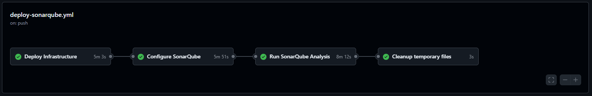
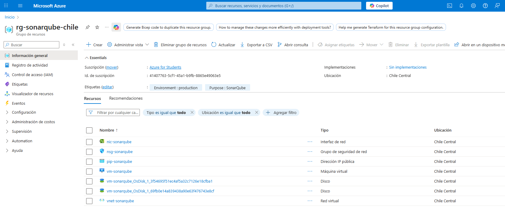
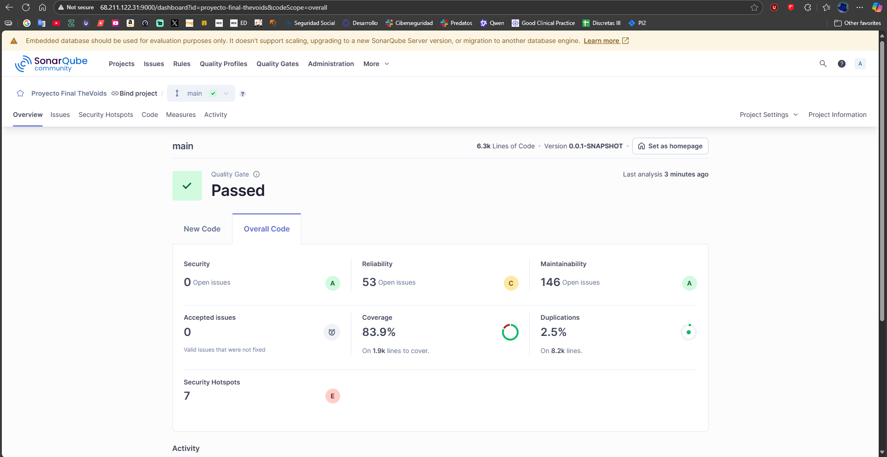
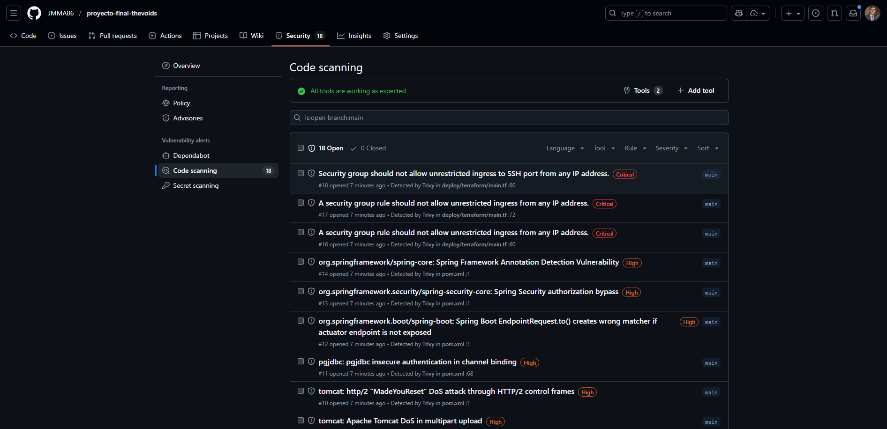

# Final Project - The Voids

This is the final project for the Computation 2 course (2025), developed by the **The Voids** team. The project consists of an application based on **Spring Boot** that manages medical specialties, users, and appointments.

## Members

- Juan Manuel Marín (A00382037)

## Technologies Used

- **Java**: Main backend language.
- **Spring Boot**: Framework for backend development.
- **Maven**: Dependency management and build tool.
- **SQL**: Relational database for data storage.
- **JavaScript**: For frontend features (if applicable).

## Features

- Management of medical specialties.
- Management of users and their specialties.
- Management of medical appointments.
- Data validation and exception handling.
- Test coverage with **JaCoCo**.

## Prerequisites

- **Java 17** or higher.
- **Maven 3.8** or higher.
- **PostgresSQL** or any database compatible with Spring Data JPA.
- **IntelliJ IDEA** (optional but recommended).

## Installation

1. Clone the repository:

   ```bash
   git clone https://github.com/Computacion-2-2025/proyecto-final-thevoids.git
   cd proyecto-final-thevoids
   ```

2. Open the project in your favorite IDE (IntelliJ IDEA recommended).

## Useful Links

- [Test Plan](./doc/test_plan.md)
- [Data Model Analysis](./doc/model_analysis.md)
- [Data Insertion Script](./src/main/resources/data.sql)

## Execution Instructions

To run the project, simply use the command:

```bash
.\mvnw spring-boot:run
```

## URLs allowed so far

### Public Resources

- `/css/**` - Stylesheet files.
- `/js/**` - JavaScript files.
- `/img/**` - Image files.

### Protected Resources

- `/web/users/**` - Requires `VIEW_USERS` permission.
- `/web/roles/**` - Requires `VIEW_ROLES` permission.
- `/web/permissions/**` - Requires `VIEW_PERMISSIONS` permission.
- `/web/admin/**` - Requires `ADMIN` role.

### Authentication

- `/web/auth/login` - Login page (public).
- `/web/auth/logout` - Logout URL (public).
- `/web/home` - Redirect after successful login.

## Test Execution

To run unit and integration tests, use the following command:

```bash
.\mvnw clean test
```

To run postman collection, sign in postman -> import -> Run

This will generate a code coverage report using **JaCoCo**. You can find the report at  
`target/site/jacoco/index.html`.

### Latest coverage achieved


## Swagger

This project includes comprehensive API documentation using Swagger/OpenAPI 3.0. The API endpoints are thoroughly documented with detailed descriptions, request/response schemas, and possible HTTP status codes.


To access the Swagger documentation:

1. Run the application locally
2. Navigate to: `http://localhost:8080/swagger-ui/index.html`

The documentation includes detailed information about all REST endpoints:

- RestAppointmentController.java
- RestAppointmentTypeController.java
- RestAuthController.java
- RestClinicAssignmentController.java
- RestClinicController.java
- RestHomeController.java
- RestLabController.java
- RestMedicalHistoryController.java
- RestPatientController.java
- RestPermissionController.java
- RestRoleController.java
- RestScheduleController.java
- RestSpecialtyController.java
- RestTaskController.java
- RestUserController.java
- RestUserSpecialtyController.java

Each endpoint is annotated with:

- Operation descriptions in Spanish
- Required permissions
- Expected request/response schemas
- Possible response codes and their meanings
- Parameter descriptions

The documentation is implemented using annotations like `@Operation`, `@ApiResponses`, `@Parameter`, and `@Tag`, making it easy for developers to understand and interact with the API endpoints through the Swagger UI interface.

## CI/CD Pipeline and Code Quality Analysis

This project implements a comprehensive CI/CD pipeline using GitHub Actions that automates infrastructure deployment, code quality analysis, and security vulnerability scanning.

### Workflow Overview

The deployment workflow (`deploy-sonarqube.yml`) is structured into four main jobs:

1. **Infrastructure Deployment**: Provisions Azure cloud resources using Terraform
2. **SonarQube Configuration**: Configures SonarQube server using Ansible
3. **Code Analysis**: Runs SonarQube analysis and Trivy security scanning
4. **Cleanup**: Manages artifacts and sensitive data



### Infrastructure Components

The pipeline automatically deploys the following Azure resources:

- **Resource Group**: Container for all SonarQube-related resources
- **Virtual Network**: Isolated network environment with subnet configuration
- **Network Security Group**: Firewall rules allowing HTTP (port 9000) and SSH access
- **Public IP Address**: External access point for the SonarQube server
- **Network Interface**: VM network connectivity with security group association
- **Linux Virtual Machine**: Ubuntu-based server hosting SonarQube in Docker containers



### SonarQube Code Analysis

The pipeline integrates comprehensive code quality analysis using SonarQube, providing:

- **Code Coverage Analysis**: Automated test coverage reporting using JaCoCo
- **Code Quality Metrics**: Analysis of code smells, bugs, vulnerabilities, and duplications
- **Technical Debt Assessment**: Quantification of maintenance effort required
- **Quality Gate Enforcement**: Automated quality thresholds for continuous integration

**Latest Coverage Results**: 83.9% test coverage achieved through comprehensive unit and integration testing.



### Security Analysis with Trivy

The workflow includes automated security vulnerability scanning using Trivy, which performs:

- **Filesystem Scanning**: Detection of vulnerabilities in source code and configuration files
- **Dependency Analysis**: Identification of known vulnerabilities in Maven dependencies
- **Secret Detection**: Scanning for exposed credentials and sensitive information
- **Configuration Assessment**: Security analysis of infrastructure and application configurations

**Security Report Generation**:

- SARIF format reports are generated for integration with GitHub Security tab
- Detailed vulnerability reports categorized by severity (Critical, High, Medium, Low)
- Automated artifact retention for compliance and audit purposes



### Deployment Features

The workflow includes several advanced features:

- **Resource Import Logic**: Intelligent detection and import of existing Azure resources
- **Rollback Capabilities**: Option to destroy infrastructure when needed
- **Error Handling**: Comprehensive error recovery and retry mechanisms
- **Secrets Management**: Secure handling of Azure credentials and deployment secrets
- **Multi-stage Validation**: Health checks and readiness verification at each stage

### Results Integration

All analysis results are integrated into the development workflow:

- **SonarQube Dashboard**: Accessible via deployed Azure infrastructure for detailed code quality insights
- **GitHub Security Tab**: Trivy vulnerability findings are automatically uploaded and displayed
- **Workflow Artifacts**: Detailed reports available for download and review
- **Pull Request Integration**: Quality gates can block merging of code that doesn't meet standards

This comprehensive approach ensures code quality, security compliance, and infrastructure reliability while maintaining an efficient development workflow.
